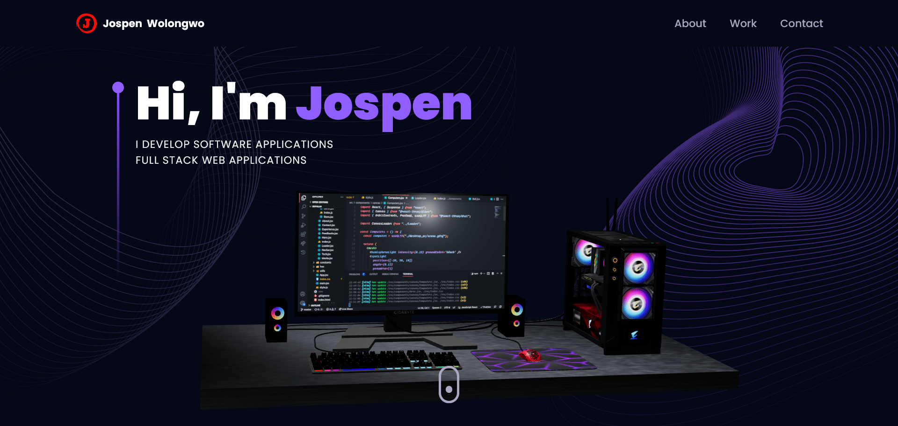

# Jospen Wolongwo - Professional Portfolio



## 🌟 [Live Portfolio](https://jospenwolongwo.com) 🌟

This repository contains the source code for my professional portfolio showcasing my skills, projects, and experience as a Software Engineer.

## About Me

I'm a Software Engineer with a passion for building scalable, user-focused applications. I have over three years of hands-on experience working with both front-end tools like Angular and React and back-end frameworks such as NestJS, SpringBoot and Laravel.

I enjoy solving complex problems by creating efficient, practical solutions. In my work, I've streamlined deployments using Docker, improved team workflows in agile environments, and focused on delivering high-performance applications.

I'm always eager to learn and grow, and I'm excited to contribute to innovative projects that make a real impact.

## 🛠️ Technologies & Skills

- **Front-end**: React, Angular, TypeScript, JavaScript, TailwindCSS, HTML, CSS
- **Back-end**: NestJS, SpringBoot, Laravel, Node.js, Express
- **Databases**: PostgreSQL, MongoDB, MySQL
- **DevOps**: Docker, CI/CD
- **Other**: RESTful APIs, GraphQL, Agile Methodologies

## 📂 Featured Projects

### Pikdrive

**Modern Ride-sharing Platform**  
[GitHub Repository](https://github.com/JospenWolongwo/pickdrive) | [Live Demo](https://pikdrive.com)  
A modern ride-sharing platform connecting drivers and passengers with real-time tracking, secure payments, and a responsive UI. Supports PWA capabilities for mobile installation.

### Hopimed

**Healthcare Availability App**  
[GitHub Repository](https://github.com/JospenWolongwo/hopimed) | [Live Demo](https://hopimed.netlify.app)  
Healthcare availability app that helps users find available doctors, pharmacies, and hospitals in their vicinity with real-time updates and emergency service status.

### Hello Hardware

**Full-stack Hardware Management System**  
[GitHub Repository](https://github.com/JospenWolongwo/hello-hardware)  
Full-stack hardware management system with customer-facing interface and admin dashboard. Built using NX monorepo architecture with Angular frontends and NestJS backend.

### Hello Identity

**Comprehensive Authentication Service**  
[GitHub Repository](https://github.com/JospenWolongwo/hello-identity)  
Comprehensive authentication service with secure user authentication, identity management, and multi-client support. Features include OAuth integration and token management.

### SecureVault Military

**Secure Document Storage Platform**  
[GitHub Repository](https://github.com/JospenWolongwo/secure-vault-military) | [Live Demo](https://secure-vault-military.netlify.app/dashboard)  
Secure document storage and communication platform for military personnel with end-to-end encryption, role-based access control, and audit logging.

### Event Portal

**Event Management Platform**  
[GitHub Repository](https://github.com/JospenWolongwo/event-portal) | [Live Demo](https://event-planning-portal.vercel.app)  
A comprehensive event management platform for creating, discovering, and registering for events with secure payment processing. Features include event discovery, real-time updates, and an admin dashboard.

### BlueWindow Todo

**Full-stack Task Management Application**  
[GitHub Repository](https://github.com/JospenWolongwo/bluewindow-todo-fullstack) | [Live Demo](https://bluewindow-todo-fullstack-production.up.railway.app)  
Full-stack todo application with authentication, task prioritization, and responsive UI. Built with NestJS, TypeORM, PostgreSQL, and Angular with containerized deployment.

### Barber Shop Website

**Modern Responsive Website**  
[GitHub Repository](https://github.com/JospenWolongwo/barber-shop-website) | [Live Demo](https://jospenwolongwo.github.io/barber-shop-website)  
Modern, responsive barber shop website with service pricing, booking form, gallery, and location information. Built with React and custom CSS styling.

### Blood Donate

**Blood Donation Platform**  
[GitHub Repository](https://github.com/JospenWolongwo/donatetheblood)  
Web-based platform that allows users to search and book appointments with blood donors, providing a convenient and efficient solution for blood donation barriers and shortages.

## 🔧 Portfolio Features

- Interactive 3D elements using Three.js
- Responsive design for all devices
- Modern UI/UX with smooth animations
- Comprehensive project showcase
- Contact form for easy communication

## 📫 Contact

- **Email**: jospen.wolongwo@gmail.com
- **LinkedIn**: [jospen-wolongwo](https://linkedin.com/in/jospen-wolongwo)
- **GitHub**: [JospenWolongwo](https://github.com/JospenWolongwo)

## 🚀 Installation & Setup

```bash
# Clone the repository
git clone https://github.com/JospenWolongwo/portfolio.git

# Navigate to the directory
cd portfolio

# Install dependencies
npm install

# Start the development server
npm run dev
```

## 📄 License

This project is licensed under the MIT License - see the LICENSE file for details.
